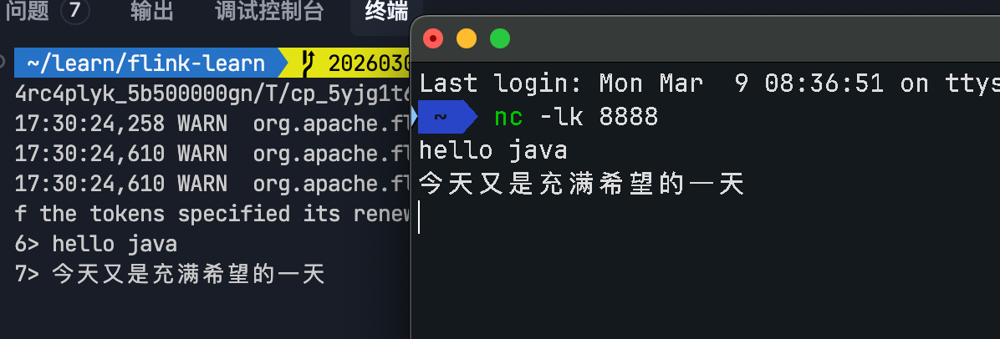

# Source
Data Source 字面意思就是 **数据来源**   
在流/批处理中, 常见的 Source主要有两大类(预定义和自定义)
## 预定义的 Source

### fromSource
示例: 
com.chenpi.job.FileReadUseFromSourceJob
```java
DataStream<String> lines = env.fromSource(
                fileSource,
                WatermarkStrategy.noWatermarks(),
                "File Source"
        );
```

### fromFile
示例: FileReadUseReadFileSourceJob
```java
//方式 1:
StreamExecutionEnvironment env = StreamExecutionEnvironment.getExecutionEnvironment();
DataStreamSource<String> fileSource = env.readTextFile(filePath);

// 方式 2:
TextInputFormat inputFormat = new TextInputFormat(new Path(filePath));
DataStreamSource<String> dataStream = env.readFile(inputFormat, filePath);
```

## fromCollection
示例: CollectionSourceJob.java
```java
List<String> list = List.of("1", "2", "3");
DataStreamSource<String> dataSource1 = env.fromCollection(list);
dataSource1.print();

DataStreamSource<String> dataSource2 = env.fromElements("hello", "java");
dataSource2.print();

DataStreamSource<Long> dataSource3 = env.fromSequence(1, 100);
dataSource3.print();

```
## Socket
socketTextStream(String hostname, int port) 方法是一个非并行的 Source,改方法需要传入两个参数,第一个是指定的 IP 地址或主机名, 第二个是端口号, 即从指定的 Scoket 读取数据创建 DataStream 该方法还有多个重载方法. 其中一个是 socketTextStream(String hostname, int port, String delimiter, long maxRetry), 这个重载方法可以指定行分隔符和最大重新链接次数. 这两个参数默行分隔符是"\n", 最大重新链接次数为 0

示例: SocketSourceJob.java
```java
// 1. 先启动 socket  在终端运行 nc -lk 8888
// 2. 代码示例
DataStreamSource<String> dataSource = env.socketTextStream("localhost", 8888);
        dataSource.print();
```
在 终端输入任意文字 + 回车可以在控制台看到输入的文字   


## KafkaSource
示例: ConsumerKafkaJob


## 自定义的 Source
`SourceFunction`: 接口, 并行数据源
`RichSourceFunction`: 类, (并行度==1)
`ParallelSourceFunction`: 并行数据源(并行度能够 >=1)


# Transformation 转换算子
## map算子
> 一进一出   

假设有以下数据
```text
86.149.9.216 10001 17/05/2015:10:05:30 GET /presentations/logstash-monitorama-2013/images/github-contributions.png
83.149.9.216 10002 17/05/2015:10:06:53 GET /presentations/logstash-monitorama-2013/css/print/paper.css
83.149.9.216 10002 17/05/2015:10:06:53 GET /presentations/logstash-monitorama-2013/css/print/paper.css
83.149.9.216 10002 17/05/2015:10:06:53 GET /presentations/logstash-monitorama-2013/css/print/paper.css
83.149.9.216 10002 17/05/2015:10:06:53 GET /presentations/logstash-monitorama-2013/css/print/paper.css
83.149.9.216 10002 17/05/2015:10:06:53 GET /presentations/logstash-monitorama-2013/css/print/paper.css
83.149.9.216 10002 17/05/2015:10:06:53 GET /presentations/logstash-monitorama-2013/css/print/paper.css
10.0.0.1 10003 17/05/2015:10:06:53 POST /presentations/logstash-monitorama-2013/css/print/paper.css
10.0.0.1 10003 17/05/2015:10:07:53 POST /presentations/logstash-monitorama-2013/css/print/paper.css
10.0.0.1 10003 17/05/2015:10:08:53 POST /presentations/logstash-monitorama-2013/css/print/paper.css
10.0.0.1 10003 17/05/2015:10:09:53 POST /presentations/logstash-monitorama-2013/css/print/paper.css
10.0.0.1 10003 17/05/2015:10:10:53 POST /presentations/logstash-monitorama-2013/css/print/paper.css
10.0.0.1 10003 17/05/2015:10:16:53 POST /presentations/logstash-monitorama-2013/css/print/paper.css
10.0.0.1 10003 17/05/2015:10:26:53 POST /presentations/logstash-monitorama-2013/css/print/paper.css
```
将其转换为一个LogBean对象，并输出
示例: com.chenpi.job.LogBeanJob

# Sink
